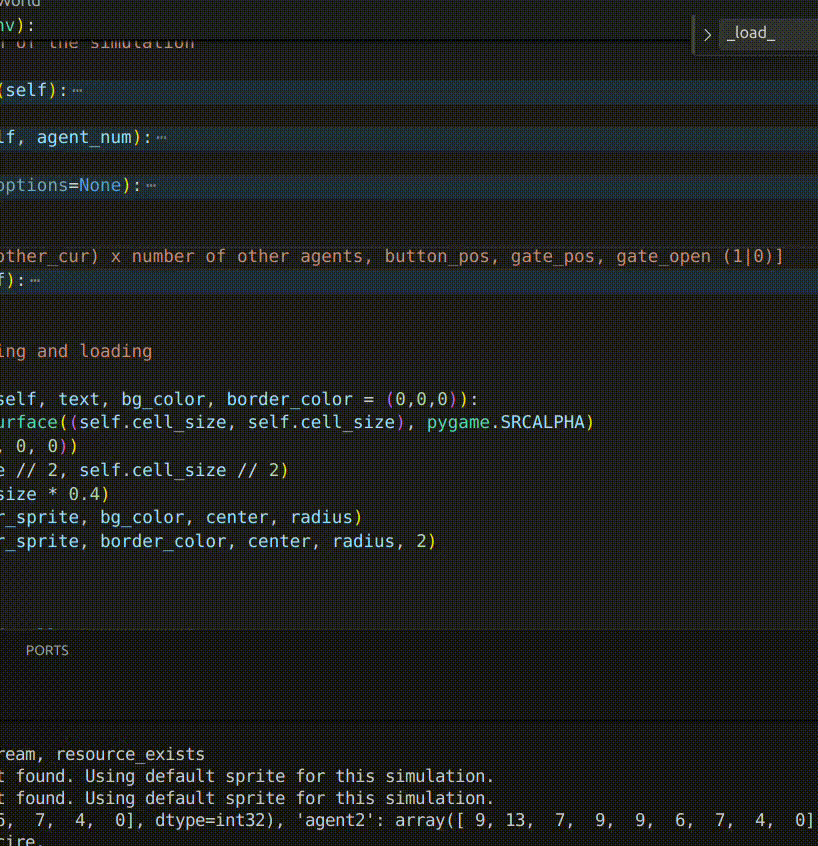

# Multiple Agent RL
Proposal of "Dstributed AI" exam project.

Gridworld cooperative game.




### Observation of each agent
Observation: [my_cur_pos, (other_cur) x number of other agents, button_pos, gate_pos, gate_open (1|0)]

Where each pos is a tuple (x,y)

### Elements
Variable number of agents (in the simulation 2).
One button, while pressed makes the gate open (self.gate_open = True).
One gate, when open vecomes a walkable cell otherwise it behaves as a wall.


### Goal of the agents
The agents goal is to walk in the other room, behind the gate.
The reward function has not been defined yet. Now I focused on the environment only.

### Environment implementation
Environment has been implemented basing on [ParallelEnv](https://pettingzoo.farama.org/api/parallel/ ) of PettingZoo.
It implements all the necessary methods and has all the required class variables. The compliance with the ParallelEnv requirements has been tested with the function [test_my_env](test_parallel_env.py) that exploits [testing function provided in PettingZoo documentation](https://pettingzoo.farama.org/content/environment_tests/) .


## Two different solutions to try it
### - Solution 1
Install dependencies from requirements.txt
These requirements match with Python 3.10.19
```bash
pip install requirements.txt
```
### - Solution 2
Create conda environment with environment.yml
```bash
conda env create -f environment.yml
```